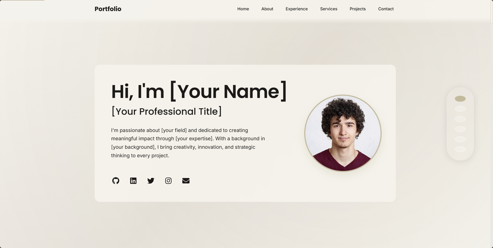

# Demo
https://ef-portfolio01.vercel.app/



# Modern Portfolio Template

A modern, responsive portfolio template built with React, TypeScript, and Vite. Features smooth animations and accessibility-first design.

- **Tech Stack**: React 18, TypeScript, Vite
- **Fully Responsive**: Responsive design that works on all devices

## 🛠️ Installation

1. Clone the repository:
```bash
git clone https://github.com/elijah-farrell/portfolio-template.git
cd portfolio-template
```

2. Install dependencies:
```bash
npm install
```

3. Start the development server:
```bash
npm run dev
```

## 🎨 Customization

### Personal Information
Edit the following files to customize your portfolio:

1. `src/components/sections/Hero.tsx`:
   - Update your name, title, and description
   - Modify social media links and profile image

2. `src/components/sections/About.tsx`:
   - Update your personal story and background
   - Modify the image slider content

3. `src/components/sections/Projects.tsx`:
   - Add your projects and their details
   - Update project images and links

4. `src/components/sections/Contact.tsx`:
   - Customize contact information and social links

5. `src/components/sections/Experience.tsx`:
   - Update your work experience and timeline

6. `src/components/sections/Services.tsx`:
   - List your services and expertise areas

### Styling
- Theme customization: `src/styles/theme.ts`
- Global styles: `src/styles/GlobalStyles.tsx`
- Color scheme and spacing can be adjusted in the theme file

## 🚀 Deployment

This project is currently deployed on Vercel. The deployment is configured through:

1. **Vercel Integration**: Connected to the GitHub repository for automatic deployments
2. **Build Command**: `npm run build`
3. **Output Directory**: `dist`

### Local Development

For local development and testing:
```bash
npm run dev          # Start development server
npm run build        # Build for production
npm run preview      # Preview production build
npm run lint         # Lint code with ESLint
```

## 📦 Available Scripts

- `npm run dev`: Start development server
- `npm run build`: Build for production
- `npm run preview`: Preview production build
- `npm run lint`: Lint code with ESLint

## 🔧 System Requirements

- Node.js 18+
- npm 7+

## 📄 License

MIT License - feel free to use this tempalte for your portfolio!
